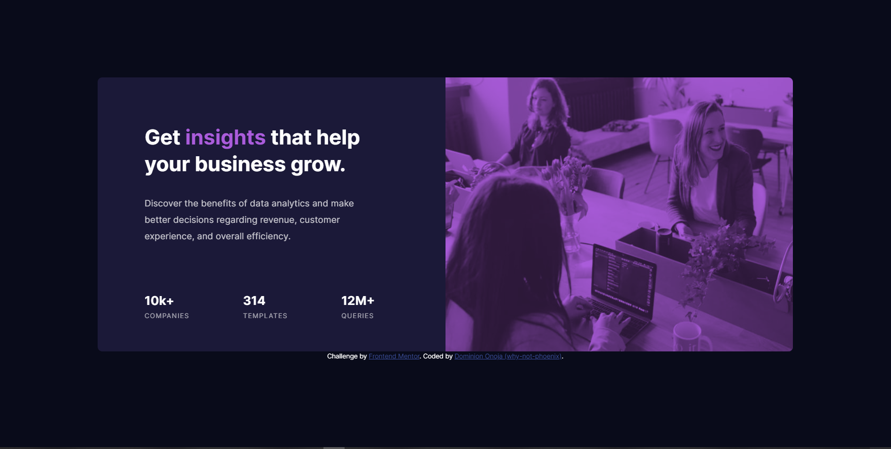

# Frontend Mentor - Stats preview card component solution

This is a solution to the [Stats preview card component challenge on Frontend Mentor](https://www.frontendmentor.io/challenges/stats-preview-card-component-8JqbgoU62). Frontend Mentor challenges help you improve your coding skills by building realistic projects.

## Table of contents

- [Overview](#overview)
  - [The challenge](#the-challenge)
  - [Screenshot](#screenshot)
  - [Links](#links)
- [My process](#my-process)
  - [Built with](#built-with)
  - [What I learned](#what-i-learned)
  - [Continued development](#continued-development)
- [Author](#author)

## Overview

### The challenge

Users should be able to:

- View the optimal layout depending on their device's screen size

### Screenshot

### Links

- Solution URL: [https://github.com/why-not-phoenix/stats-preview-card-component-main.git](https://github.com/why-not-phoenix/stats-preview-card-component-main.git)
- Live Site URL: [https://why-not-phoenix.github.io/stats-preview-card-component-main/](https://why-not-phoenix.github.io/stats-preview-card-component-main/)

## My process

### Built with

- Semantic HTML5 markup
- CSS custom properties
- Flexbox
- Mobile-first workflow

### What I learned

This was harder than I imagined. I guess if there was anything I learned it'll be just finding ways to solve problems even though my methods might not be conventional.

### Continued development

- Need to get a could gasp of "blend". Don't really understand it.
- Need to improve on usage of media queries and generally building responsive sites.

## Author

- Website - [Dominion Onoja](https://why-not-phoenix.github.io/cv/) - Very temporary site
- Frontend Mentor - [@why-not-phoenix](https://www.frontendmentor.io/profile/why-not-phoenix)
- Twitter - [@dominion_onoja](https://twitter.com/dominion_onoja)
